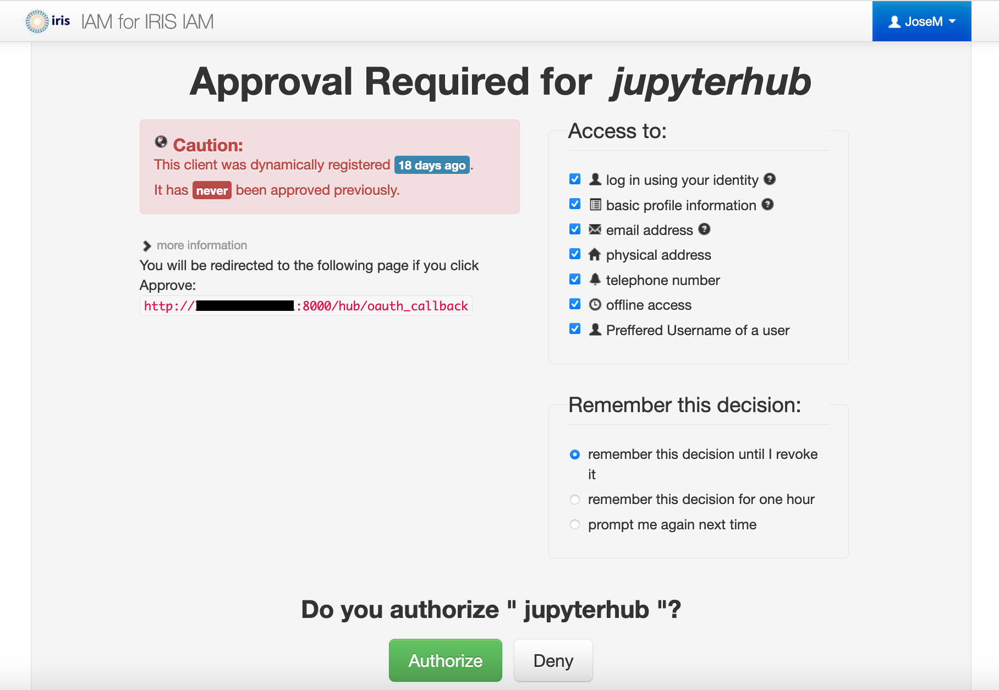

Bare metal
==========
JupyterHub can be deployed in bare metal systems. This is the way it was done by the
Gravity Exploration Institute at Cardiff University to make a set of Python 
environments (3.6, 3.7 and 3.8) available to its users.

The main difference with a traditional JupyterHub `installation <https://jupyterhub.readthedocs.io/en/stable/installation-guide-hard.html>`_ 
is the use of conda to install a full environment rather than the recommended
combination of pip/conda.

The main steps are:

#. Install JupyterHub dependencies:

   * Nodejs
   * npm
   * systemd
   * httpd
   * miniconda

#. Create JupyterHub group for sudospawner
#. Create JupyterHub user
#. Create a sudoers file
#. Create a configuration file
#. Create an anaconda virtual environment file for JupyterHub.
#. Create a sudospawner configuration file
#. Create JupyterHub's systemd service file
#. Create JupyterHub's httpd configuration file
#. Create JupyterHub's static kernels
#. Provision the kernels with the required environments
#. Create a suitable script to start JupyterHub
#. Optionally create a suitable logo to display in JupyterHub
#. Start the JupyterHub service

There is an ansible script available to try to automatize this process.

Installing Anaconda
-------------------
The first step is making sure that conda>4.8.3 is available in the system or download
and install otherwise:

miniconda/tasks/main.yml:

.. literalinclude:: scripts/ansible/playbook/roles/miniconda/tasks/main.yml
  :language: ruby

Where the different variables are defined in *defaults* and *vars*:

miniconda/defaults/main.yml

.. literalinclude:: scripts/ansible/playbook/roles/miniconda/defaults/main.yml
  :language: ruby

miniconda/vars/main.yml

.. literalinclude:: scripts/ansible/playbook/roles/miniconda/vars/main.yml
  :language: ruby

Installing other dependencies
-----------------------------
Depending on the Linux distribution used, the way to install the rest of 
dependencies may vary. This guide has been tested in Centos 7.

In this step we install (in case they are not already available):

* nodejs
* npm
* systemd
* httpd

In the case of nodejs, it might be necessary to first install Node repository. We
can do this by `downloading <https://github.com/nodesource/distributions>`_ the 
installers and running them locally. We can use the following ansible role to perform
the installation:

node/tasks/main.yml

.. literalinclude:: scripts/ansible/playbook/roles/node/tasks/main.yml
  :language: ruby

Authentication
--------------
For demonstration purposes we show how to configure via PAM (Ligo uses Shibboleth for authentication purposes). The authentication method to use can be defined in 
JupyterHub configuration file:

jupyterhub/templates/jupyterhub_config.py.j2

.. literalinclude:: scripts/ansible/playbook/roles/jupyterhub/templates/jupyterhub_config.py.j2

As mentioned, by commenting out the authenticator class JupyterHub falls back to 
using PAM authentication method.

IRIS IAM
^^^^^^^^^^^^^^
It is possible to authenticate using IRIS IAM. For this some changes and additional
packages are required. 

* **Dependencies**: OAuth should be installed using pip. This can be added to the
  original conda environment definition: 

  jupyterhub/files/jupyterhub-environment-iris-iam.yml

  .. literalinclude:: scripts/ansible/playbook/roles/jupyterhub/files/jupyterhub-environment-iris-iam.yml

* **Client registration**: JupyterHub needs to be registered as a IAM client on `IRIS IAM <https://iris-iam.stfc.ac.uk/>`_
  
  .. image:: figures/baremetal/iris-iam-dashboard.png

  From here follow the instructions in the `INDIGO IAM <https://indigo-iam.github.io/docs/v/current/user-guide/client-registration.html>`_ documentation site. You will 
  need to enter the public IP address and port of the server running JupyterHub in
  the *Redirect URI(s)* field.
  
  Make sure to save the client credentials for your client as they will allow you to
  modify its settings later on and configure JupyterHub.

* **JupyterHub configuration**: The *GenericOAuthenticator* method is used to 
  interact with IRIS IAM and requires configuring a few settings including the client
  id and client secret provided in the previous step. We also need to provide the 
  address to which the user will be redirected after successful authentication
  (this address needs match to one defined during the client registration step).
  
  IAM authentication requires defining a few environment variables and make them
  visible by JupyterHub. In our current setup the JupyterHub user, jupyterhub, is a
  nologin non-interactive user and one way to define these environment variables is
  to add them in the JupyterHub configuration file using the *os* module.

  Another thing to keep in mind is that our current setup requires the authenticated
  user to have a matching account in the system running JupyterHub. This is, if user
  "John" authenticates in IRIS IAM, JupyterHub's spawner (sudospawner in our current
  case) will try to start a Jupyter server for user "John" in the local system 
  failing if the user cannot be found.

  .. literalinclude:: scripts/ansible/playbook/roles/jupyterhub/templates/jupyterhub_config_iris_iam.py.j2

After configuration, the user would navigate to the JupyterHub's server address and
be greeted by a message like:

And then the user should be redirected to IRIS IAM login website:

Our client needs to be approved by the user the first time it is used by that user.
After authorization the user should be redirected to the Jupyter server spawned by
the Hub.

Spawner
-------
Ligo uses a Custom Spawners for JupyterHub (SudoSpawner) to start each single-user 
notebook server. This spawner enables JupyterHub to run without being root, by 
spawning an intermediate process via sudo. This seems like a sensible choice to 
improve system security. In JupyterHub configuration file this is controlled with 
**sudospawner_path**. Besides this, SudoSpawner requires setting up the user that
will actually run the Hub and define which commands is it allowed to execute on 
behalf of users. This is done via a couple of configuration files:

A systemd configuration file for JupyterHub that defines the right user and location
where *jupyterhub* command should be invoked:

jupyterhub/templates/jupyterhub.service.j2

.. literalinclude:: scripts/ansible/playbook/roles/jupyterhub/templates/jupyterhub.service.j2

And a sudoers file that defines the command that JupyterHub's user is allowed to 
execute. Users are allowed to spawn a Jupyter Notebook if they are member of a 
particular group (*LIGO* in Ligo's case):

jupyterhub/templates/jupyterhub.sudofile.j2

.. literalinclude:: scripts/ansible/playbook/roles/jupyterhub/templates/jupyterhub.sudofile.j2

Defaults
--------
It is useful to define default values for some of the parameters used in our 
configuration files. Being stored in a separate file might facilitate to adapt these
templates for different cases.

jupyterhub/defaults/main.yml

.. literalinclude:: scripts/ansible/playbook/roles/jupyterhub/defaults/main.yml

Main tasks
----------
This script runs the main tasks required to deploy our JupyterHub service.

jupyterhub/defaults/main.yml

.. literalinclude:: scripts/ansible/playbook/roles/jupyterhub/tasks/main.yml

Running deployment
------------------
The files above can be run with an ansible playbook

jhub.yml

.. literalinclude:: scripts/ansible/playbook/jhub.yml
